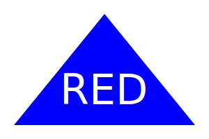

# LOGO GENERATOR

## Description
An app that generates a simple logo for a business, profile, or other needs based off the users input!  UTA Bootcamp Challenge 10.


## User Story
```
AS a freelance web developer
I WANT to generate a simple logo for my projects
SO THAT I don't have to pay a graphic designer
```

## Acceptance Criteria
```
GIVEN a command-line application that accepts user input
WHEN I am prompted for text
THEN I can enter up to three characters
WHEN I am prompted for the text color
THEN I can enter a color keyword (OR a hexadecimal number)
WHEN I am prompted for a shape
THEN I am presented with a list of shapes to choose from: circle, triangle, and square
WHEN I am prompted for the shape's color
THEN I can enter a color keyword (OR a hexadecimal number)
WHEN I have entered input for all the prompts
THEN an SVG file is created named `logo.svg`
AND the output text "Generated logo.svg" is printed in the command line
WHEN I open the `logo.svg` file in a browser
THEN I am shown a 300x200 pixel image that matches the criteria I entered
```

## Technologies Used
1. JavaScript
2. Node.js
3. Inquirer
4. Jest
5. SVG

## References
1. UTA Bootcamp curriculum, instructor examples and student solved examples
2. Andres Miro - helped with class creation and property assignment
3. Basic SVG shape components and theory - <a href='https://developer.mozilla.org/en-US/docs/Web/SVG/Tutorial/Basic_Shapes'>mdn web docs</a>
4. SVG display in HTML/CSS - <a href='https://www.freecodecamp.org/news/use-svg-images-in-css-html/#:~:text=SVG%20images%20can%20be%20written,element%20in%20your%20HTML%20document.&text=body%3E-,If%20you%20did%20everything%20correctly%2C%20your%20webpage%20should,exactly%20like%20the%20demo%20below.'>freeCodeCamp()</a>

## <a href="https://github.com/bmancuso3/logo-generator">GitHub Repository</a>

## <a href="https://bmancuso3.github.io/logo-generator">Live Site - Not Applicable</a>

## <a href="https://drive.google.com/file/d/1i4w-h0pWKxindg4VEiuMEb8uMyrDsiaH/view">Video Walk-Through</a>

## Logo Examples

### EX1


### EX2


### EX3

